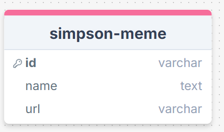

# API del Museo de Memes de Los Simpsons

Esta API REST permite gestionar los memes del Museo de Memes de Los Simpsons, integrándose con una base de datos NoSQL. Proporciona endpoints para la creación, lectura, actualización y eliminación de memes. Cada meme incluye el nombre de un personaje de Los Simpsons y un enlace a la imagen del meme.

## Tecnologías Utilizadas

-   **Node.js**: Plataforma utilizada para construir la API.
-   **Express**: Framework para gestionar rutas y middleware.
-   **MongoDB**: Base de datos NoSQL.
-   **Express Validator**: Para la validación de datos.
-   **Jest** y **Supertest**: Herramientas empleadas para realizar pruebas automatizadas.

## Base de Datos

La estructura de la base de datos fue diseñada conforme a los requisitos de la aplicación frontend en React. Es una base de datos NoSQL gestionada mediante MongoDB.

  
_Esquema gráfico de la base de datos generado con dbdiagram o drawsql._

Las tablas principales incluyen:

-   **Memes**: Contiene información sobre cada meme, como el nombre del personaje y la URL de la imagen.

## Instrucciones para Ejecutar el Proyecto

1.  Clona el repositorio:

    ```bash
    git clone https://github.com/usuario/museo-memes-simpsons-api.git
    ```

2.  Configura las variables de entorno en un archivo `.env` con los siguientes valores:

    ```bash
    DEV_DB_NAME=meme_app
    TEST_DB_NAME=meme_app_test
    DB_USER=root
    DB_PASSWORD=1234
    DB_HOST=localhost
    ```

3.  Ejecutar MongoDB:

    ```bash
    mongod
    ```

4.  Inicia el servidor:

    ```bash
    npm run dev
    ```

5.  Para ejecutar las pruebas:

    ```bash
    npm test
    ```

## Documentación

La API está documentada en Postman. Puedes importar la colección desde este enlace:

[Abrir en Postman](https://documenter.getpostman.com/view/38671791/2sAXqzXdyq)

### Endpoints

#### 1. Obtener todos los memes

-   **Method**: GET
-   **URL**: `http://localhost:3001/api/v1/memes`

**Respuesta:**

```json
{
    "ok": true,
    "status": 200,
    "body": {
        "_id": "",
        "name": "",
        "image": "",
        "createdAt": "",
        "updatedAt": "",
        "__v": 0
    }
}
```

#### 2. Obtener un meme por ID

-   **Method**: GET
-   **URL**: `http://localhost:3001/api/v1/memes/:id`

**Respuesta:**

```json
{
    "ok": true,
    "status": 200,
    "body": {
        "_id": "670797dd10b0a23c46e3242a",
        "name": "Typescript Any",
        "image": "https://res.cloudinary.com/dhbzr2e4h/image/upload/v1726683579/qrtjvyfivpsojfsi50ts.png",
        "createdAt": "2024-10-10T09:01:17.898Z",
        "updatedAt": "2024-10-10T09:01:17.898Z",
        "__v": 0
    }
}
```

#### 3. Crear un nuevo meme

-   **Method**: POST
-   **URL**: `http://localhost:3001/api/v1/memes`
-   **Body**:

```json
{
    "name": "Bart Simpson",
    "image": "Enlace de la imagen"
}
```

**Respuesta:**
Tras un posteo exitoso, la respuesta tendrá un código de estado de 201 y un cuerpo JSON con la siguiente estructura:

```json
{
    "ok": true,
    "status": 201,
    "message": "Meme Created",
    "body": {
        "meme_id": 5,
        "name": "Bart Simpson",
        "image": "Enlace de la imagen"
    }
}
```

#### 4. Actualizar un meme

-   **Method**: PUT
-   **URL**: `http://localhost:3001/api/v1/memes/:id`
-   **Body**:

```json
{
    "name": "Lisa Simpson",
    "image": "Nuevo enlace de la imagen"
}
```

**Respuesta:**
Tras una actualización exitosa, la respuesta tendrá un código de estado de 200 y un cuerpo JSON con la siguiente estructura:

```json
{
    "ok": true,
    "status": 200,
    "message": "Meme updated successfully",
    "body": {
        "meme_id": 5,
        "name": "Lisa Simpson",
        "image": "Nuevo enlace de la imagen"
    }
}
```

#### 5. Eliminar un meme

-   **Method**: DELETE
-   **URL**: `http://localhost:3001/api/v1/memes/:id`

**Respuesta:**

```json
{
    "ok": true,
    "status": 200,
    "message": "Meme deleted successfully",
    "deletedMeme": {
        "_id": 4,
        "name": "Bart Simpson",
        "image": "Enlace de la imagen"
    }
}
```
